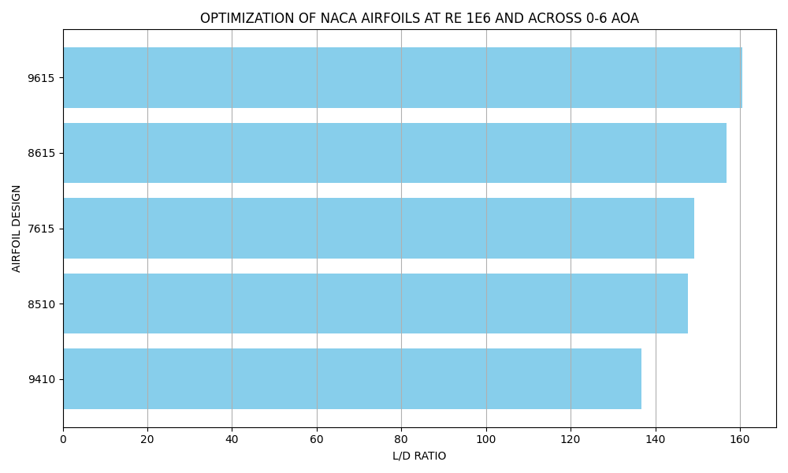

# Optimization of Airfoil Design
## Background 
In my pursuit of teaching myself aerospace topics, I came across airfoils in the context of lift and drag. An airfoil is a 2D cross-section of a curved flight surface—most commonly a wing—designed to generate lift and allow a vehicle to interact with the air. Although seemingly simple, the question of how to design the curvature of this geometry for optimal lift-to-drag ratio presents an interesting optimization problem. Realistically, this problem is more complex, as maximizing lift-to-drag can negatively impact stability and speed performance. However, as a beginner in this subject, the goal of this project is simply to maximize the lift-to-drag ratio.

## Supporting Software
In order to simulate airfoil shape and simulation, I will be using a free open source software called [XFOIL](https://web.mit.edu/drela/Public/web/xfoil/) created by MIT. 

## Airfoil Naming Convention
One way to label Airfoils is using the NACA naming convention. Specifically in this project we will be using the 4 Digit NACA naming convention which works as follows:

-**First Digit** = Max Camber in percent of chord length

-**Second Digit** = Position along airfoil where the max camber is located (also in percentage of chord length)

-**Third and Fourth Digit** = Percent maximum thickness of chord length

**Example**: NACA 2421 has a max camber of 2%, which is positioned at 40% of the chord length, and has a max thickness of 21%.

## Process
### Problem 1
In this optimization problem, Camber values between 0-9 %, Position values between 0-90%, and Thicknesses of 10-40 % were tested to find the airfoil which produces the highest Lift to Drag ratio. A constant Angle of Attack of 6 degrees and a Reynolds number of 1,000,000 were selected for this problem. A python script was created to automate the XFOIL simulations and create plots of the 5 best preforming airfoils for presentation.

- Run naca_optimization.py to experiment with the script yourself

### Problem 2
In a more complicated problem, I evaluated the same camber, position, and thickness values over varying angles of attacking ranging from 0-6 degrees. The reynolds number was still 1,000,000. Lift to drag ratios were averaged among the results of every angle for each airfoil.

- Run naca_optimization_aoa_sweep.py to experiment with the script yourself

## Results
### Problem 1
The 5 best preforming airfoils were found to be the 7410, 8410, 6410, 9410, and 5410. A simple google search will show that the most efficent and widely used airfoils are the 2412 and 4412 for their balance of stability, lift/drag, and speed. Since this optimization only takes into account 1 of these three factors, it makes sense that these results vary. Despite the simplication of the problem, we can still see the trend of smaller thicknesses, specifically the 10 %, dominated the top 5 airfoils. We can also see the the 40% position of max camber also dominating amongst other options.

### Problem 2
The 5 best preforming airfoils were found to be the 9615, 8615, 7615, 8510, and 9410. Although this problem included another element of optimization, it still doesnt account for all factors that should be considered when optimizing airfoils for performance. The trend of smaller thicknesses dominating the top 5 remains but the 50% and 60% positions of camber performed better in this example.

